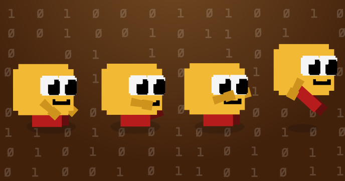

Back in the early days of home computers, sprites used to be generated only with binary numbers stored in memory.

The technique is still very usable nowadays. In this program we’ll see how to generate a sprite using only an array of numbers. 
 
## Source code 
The JavaScript source code of this program can be found [here](sketches/program.js). To run it, you need to import it in the [codeguppy.com](https://codeguppy.com) online editor. Alternatively, you can use the source code in your p5.js sketches (advanced use). 
## Online version 
To see the code running, check the online playground at [https://codeguppy.com/code.html?t=sprite_spider_array](https://codeguppy.com/code.html?t=sprite_spider_array) 
## Next steps 
Please check [codeguppy.com](https://codeguppy.com) for many other fun JavaScript programs and games for beginners. To stay up to date with CodeGuppy development please follow [@codeguppy](https://twitter.com/codeguppy) on Twitter.  
